基于 Spring Boot 的毕业就业信息管理系统（程序+论文）
=

### 完整代码获取地址：从戎源码网 ([https://armycodes.com/](https://armycodes.com/))
### 作者微信：19941326836  QQ：952045282 
### 承接计算机毕业设计、Java毕业设计、Python毕业设计、深度学习、机器学习
### 选题+开题报告+任务书+程序定制+安装调试+论文+答辩ppt 一条龙服务
### 所有选题地址https://github.com/nature924/allProject

一、项目介绍
---

基于SpringBoot+Vue的毕业就业信息管理系统，系统角色为管理员、学生、公司，主要功能如下

管理员：
基本操作：登录、修改密码、获取个人信息、修改个人信息、退出
用户管理：获取用户列表、查看详情、新增用户、修改用户、删除用户、重置密码
学生管理：筛选学生、获取学生列表、查看学生详情、新增学生、修改学生、逻辑删除、注册/登录管理、重置密码、获取会话信息
公司管理：筛选公司、获取公司列表、查看公司详情、新增公司、修改公司、逻辑删除、注册/登录管理、重置密码、获取会话信息
职位招聘管理：筛选职位、获取职位列表、查看职位详情、新增职位、修改职位、删除职位、上下架状态维护
简历管理：获取简历列表、查看简历详情、新增简历、修改简历、删除简历
简历投递管理：获取投递列表、查看投递详情、新增投递、修改投递、删除投递、防止重复投递
就业统计管理：获取统计列表、查看统计详情、新增统计、修改统计、删除统计、审核状态维护
职位留言管理：获取留言列表、查看留言详情、发布留言、回复留言、修改留言、删除留言
公告信息管理：获取公告列表、查看公告详情、发布公告、修改公告、逻辑删除

公司：
基本操作：登录、修改密码、获取个人信息、修改个人信息、注册、重置密码、退出
公司信息管理：查看/编辑本公司信息
职位招聘管理：发布职位、获取职位列表、查看职位详情、修改职位、删除职位、上下架状态维护
简历投递管理：查看收到的投递、查看投递详情（含应聘者简历）、更新投递记录
职位留言管理：查看职位留言、回复留言、删除留言
公告信息：查看公告列表、查看公告详情

学生：
基本操作：登录、修改密码、获取个人信息、修改个人信息、注册、重置密码、退出
简历管理：新建/编辑个人简历（限一份）、查看简历详情、删除简历
职位招聘：筛选职位、获取职位列表、查看职位详情
简历投递：投递职位、查看个人投递记录、查看投递详情、防重复投递
职位留言：对职位留言、查看留言与企业回复
就业统计：提交就业统计信息、查看审核状态
公告信息：查看公告列表、查看公告详情

二、项目技术
---
- 编程语言：Java
- 数据库：MySQL
- 项目管理工具：Maven
- 前端技术：VUE、HTML、Jquery、Bootstrap
- 后端技术：Spring、SpringMVC、MyBatis

三、运行环境
---
- 操作系统：Windows、macOS都可以
- JDK版本：JDK1.8以上都可以
- 开发工具：IDEA、Ecplise、Myecplise都可以
- 数据库: MySQL5.7以上都可以
- Tomcat：任意版本都可以
- Maven：任意版本都可以

四、运行截图
---
### 论文截图：
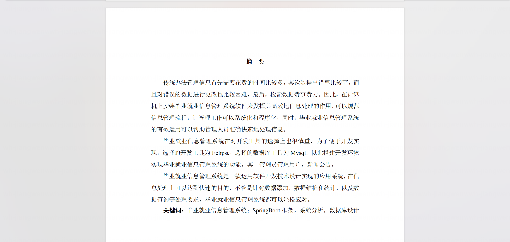

### 程序截图：
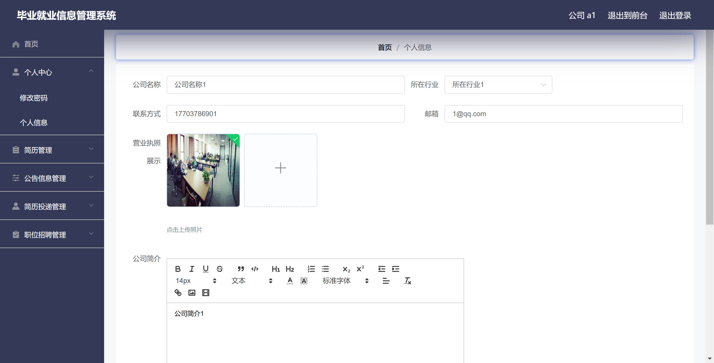
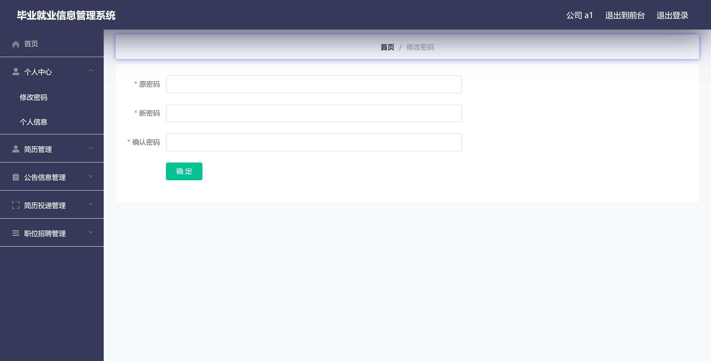
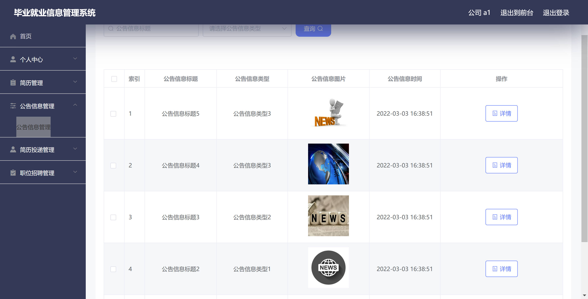
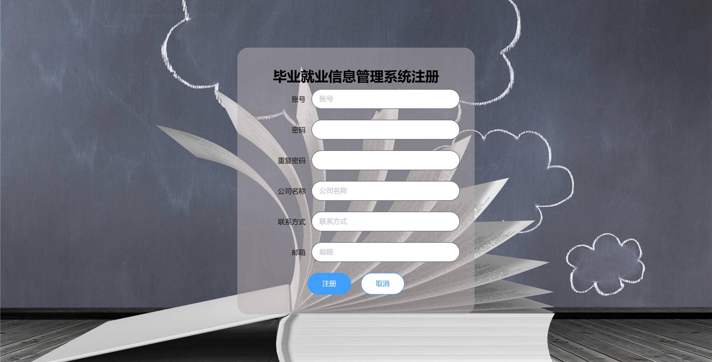
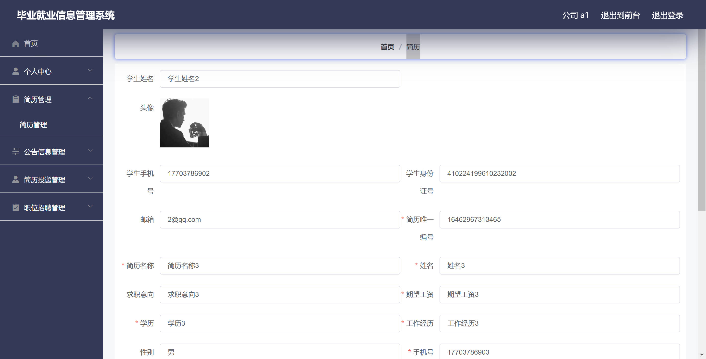
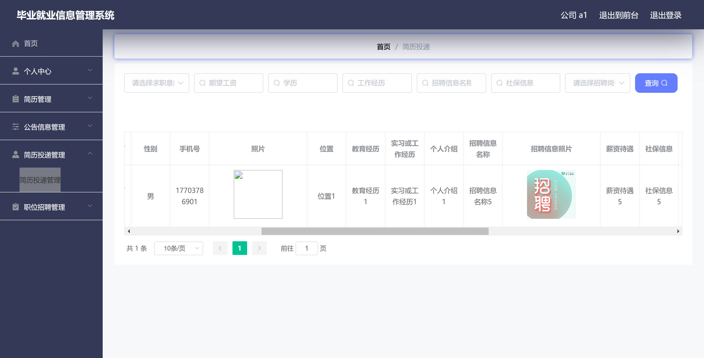
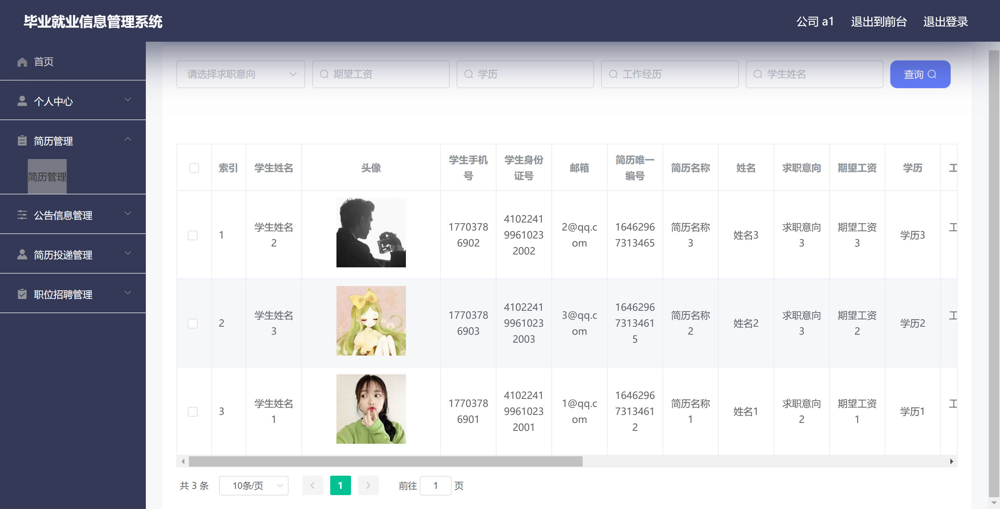
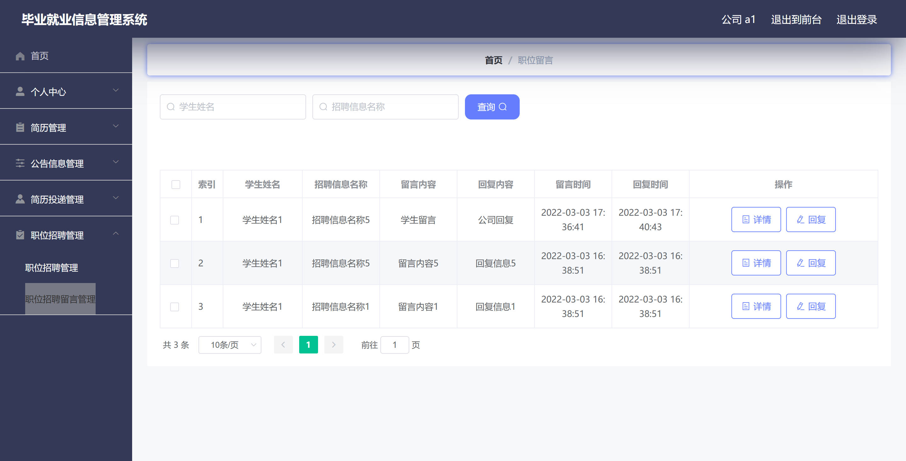
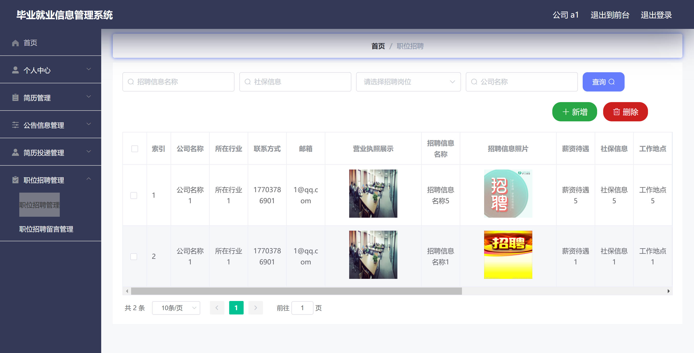
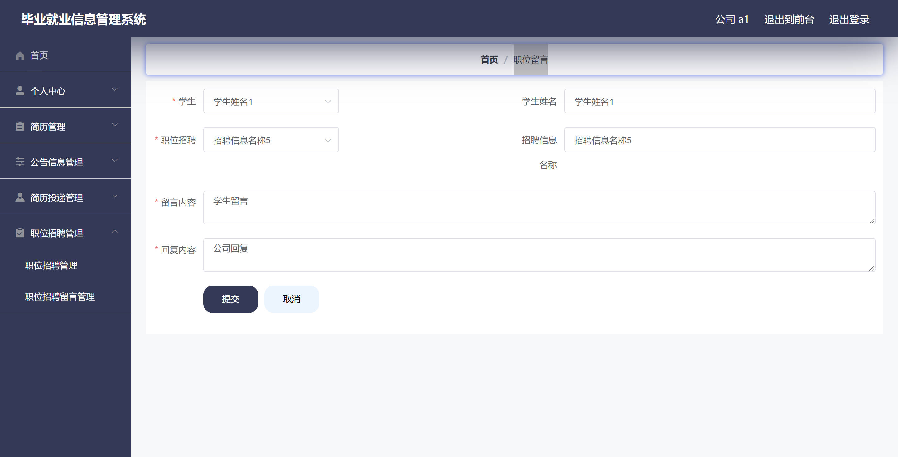
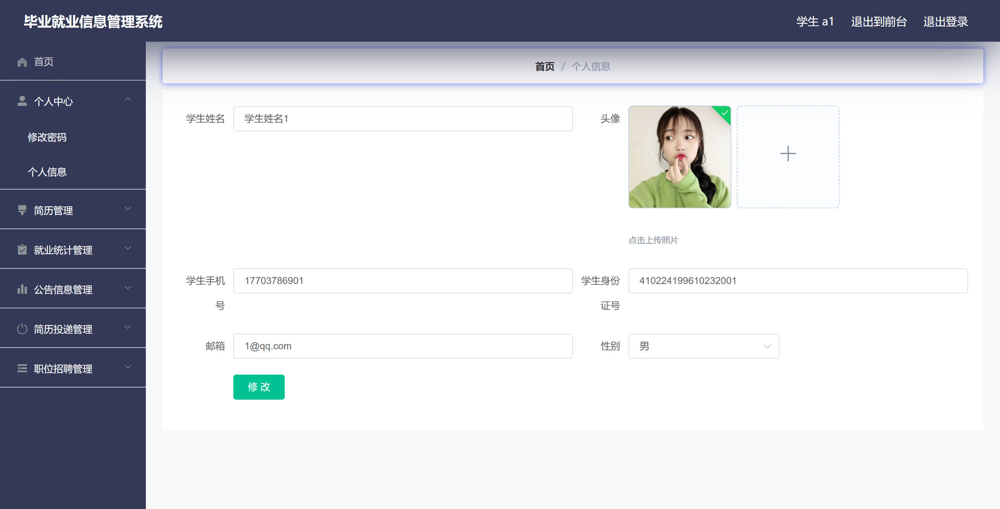
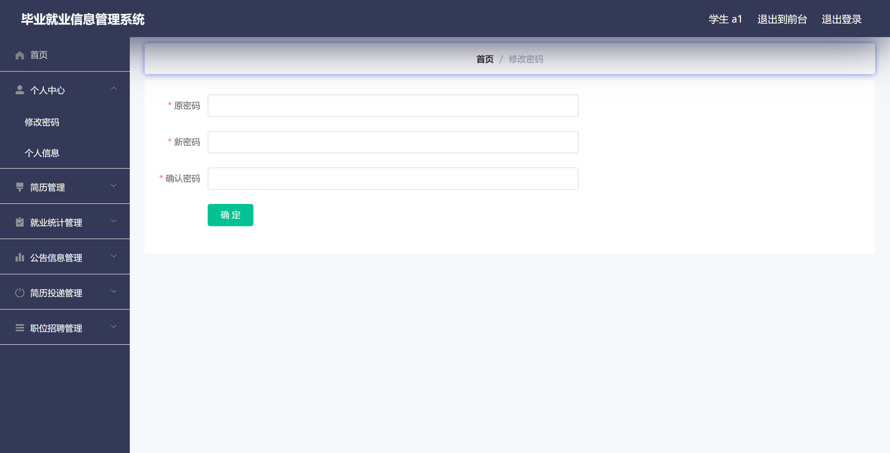
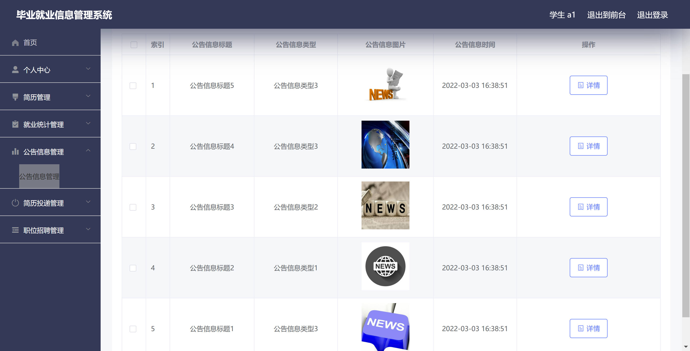
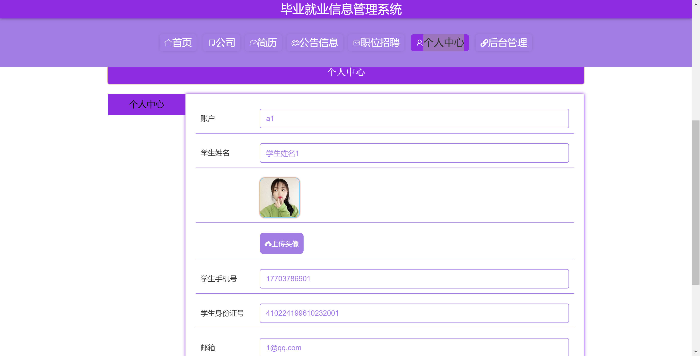
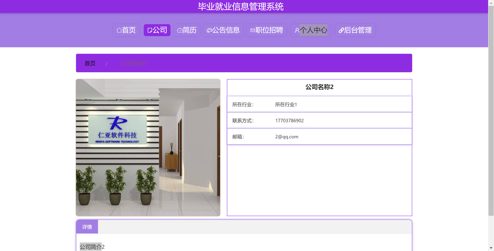

